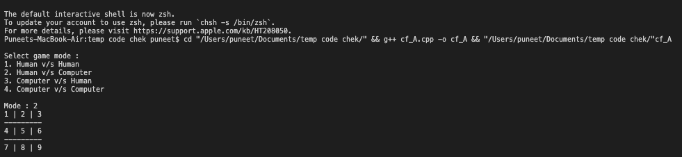
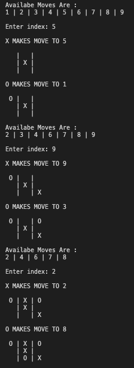
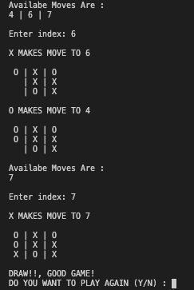

# Unbeatable-Tic_Tac_toe
Unbeatable Tic Tac Toe using MINIMAX Algorithm

Concepts Used in the Project:

-> Inheritance

-> Virtual Functions

-> Runtime polymprophism

-> Object Oriented Programming

-> MiniMax Backtracking Algorithm for decision making (AI)

MINIMAX ALGORITHM:

Minimax is a recursive algorithm which is used to choose an optimal move for a player assuming that the opponent is also playing optimally. As its name suggests, its goal is to minimize the maximum loss (minimize the worst case scenario).

